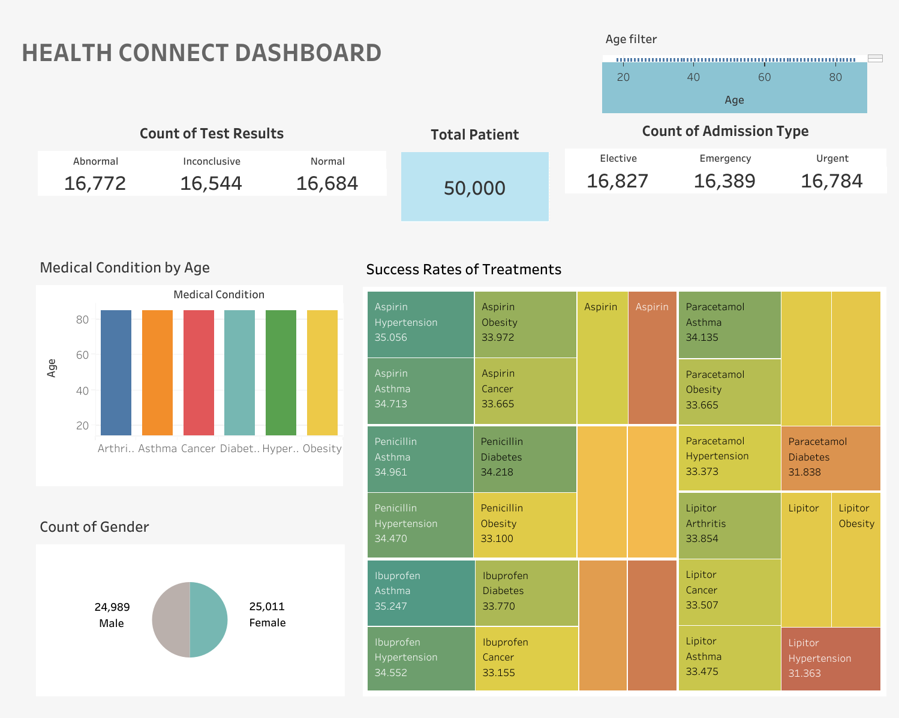

# Healthcare Data Analysis Project

## Overview  
This project involves analyzing a large healthcare dataset containing 50,000 anonymized patient records. The goal was to uncover insights and trends related to various health conditions, demographics, and outcomes to support data-driven healthcare decisions.

---

## Project Highlights  

### 1. Data Cleaning and Preparation  
- Standardized inconsistent data fields (e.g., names, dates).  
- Removed duplicates, handled missing values, and checked for outliers.  
- Organized age data into ranges (e.g., 10–19, 20–29) for better analysis.  

### 2. Exploratory Data Analysis  
- Investigated health conditions like arthritis, asthma, cancer, diabetes, hypertension, obesity, and more.  
- Analyzed demographic trends by age groups and gender.  
- Identified peaks in conditions by specific age ranges (e.g., obesity peaks in ages 50–59, hypertension in 70–79).  

### 3. Predictive Analytics  
- Used a **decision tree model** to predict patient outcomes based on factors like age, treatment type, and diagnosis.  

---

## Key Results  
- Found age groups most affected by specific health conditions, enabling targeted interventions.  
- Gender-based analysis showed fairly even distribution of conditions with some slight variations.  
- Decision tree predictions demonstrated potential for proactive healthcare planning.  

- **Interactive Dashboard:** [View the Dashboard](https://public.tableau.com/app/profile/micheal.osazuwa/viz/HEALTHCONNECTDASHBOARD/HEALTHCONNECTDASHBOARD?publish=yes)  
   
- *Detailed Report (PDF):** [Download the Report](HealthConnect-Data-Analysis-Report.pdf)
